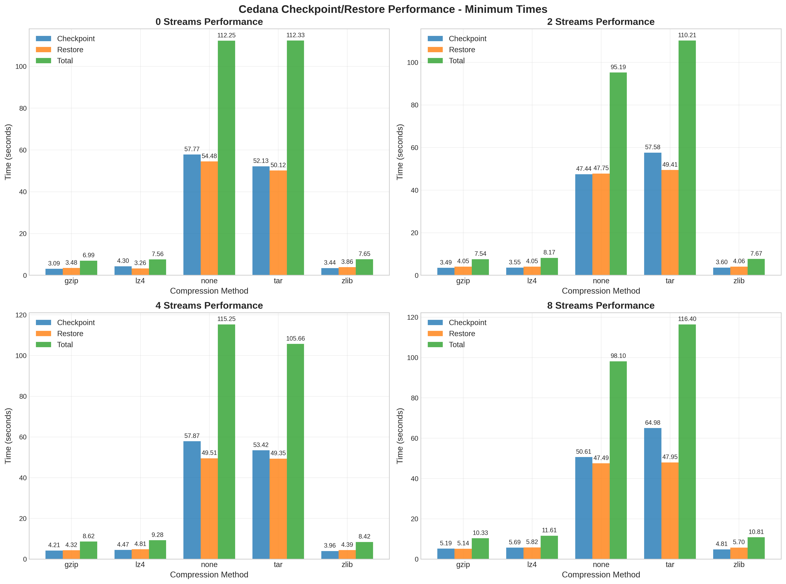
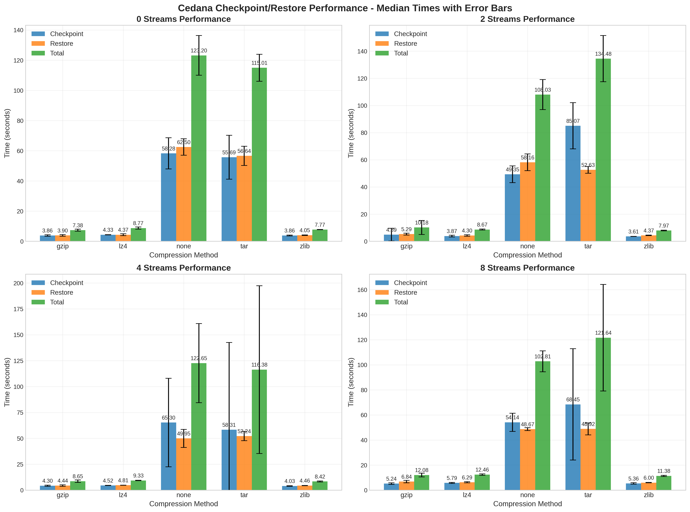
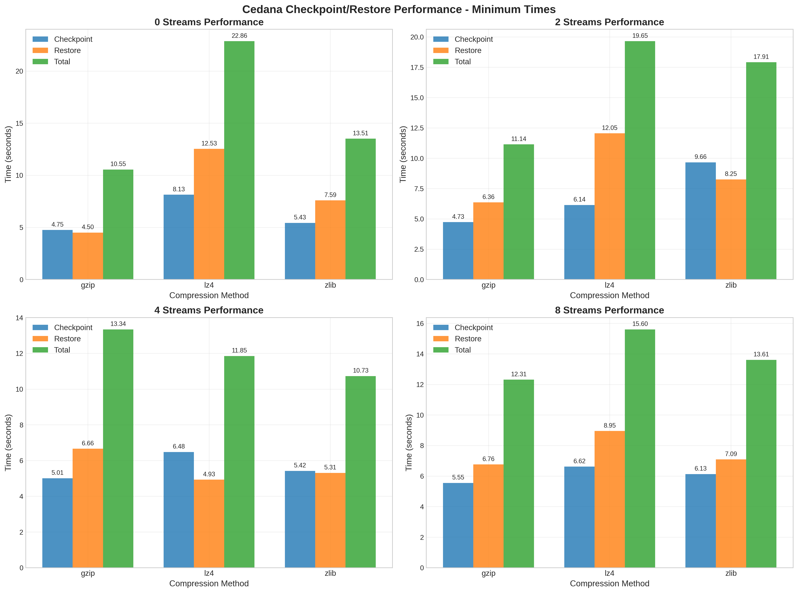
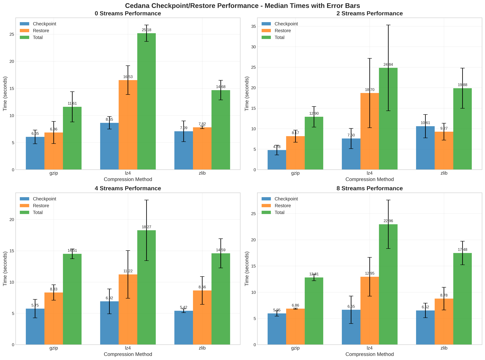

# Streamer Vs Regular Checkpoint/Restore Benchmarks

Workload: `stress.py` (uses `1` CPU core, `500MB` memory, for each of the runs you can see the state of system in `results/*_system_info.txt`)
Compression Algos: `none`, `tar`, `lz4`, `gzip`, `zlib`
Storage: `local`, `s3`, `cedana` (`s3` runs timed out for `none` and `tar`)

I did 3 Runs for each storage type.

## Benchmark Results

### Minimum Times

### Median Times

### Cedana Storage

**CEDANA PERFORMANCE SUMMARY REPORT**

- Total tests run: 60
- Configurations tested: 20

#### Minimum Times Analysis (Best Case Performance)

- Best checkpoint time: gzip with 0 streams (3.090s)
- Best restore time: lz4 with 0 streams (3.260s)
- Best total time: gzip with 0 streams (6.990s)

#### Median Times Analysis (Typical Performance)

- Best checkpoint time: zlib with 2 streams (3.610s)
- Best restore time: gzip with 0 streams (3.900s)
- Best total time: gzip with 0 streams (7.380s)

#### Stream Performance Comparison

| Streams | Min Time(s) | Median(s) | Variance(%) |
|---------|-------------|-----------|-------------|
| 0       | 49.356      | 52.426    | 6.2         |
| 2       | 45.756      | 53.866    | 17.7        |
| 4       | 49.446      | 53.086    | 7.4         |
| 8       | 49.450      | 52.074    | 5.3         |

**Speedup Analysis (relative to 0 streams):**

| Streams | Min Speedup | Median Spd. |
|---------|-------------|-------------|
| 2       | +7.3%       | -2.7%       |
| 4       | -0.2%       | -1.3%       |
| 8       | -0.2%       | +0.7%       |

#### Compression Method Ranking

| Method | Min Time(s) | Median(s) |
|--------|-------------|-----------|
| zlib   | 8.637       | 8.885     |
| gzip   | 8.370       | 9.572     |
| lz4    | 9.155       | 9.808     |
| none   | 105.197     | 114.172   |
| tar    | 111.150     | 121.877   |

### S3

- Total tests run: 36
- Configurations tested: 12

#### Minimum Times Analysis (Best Case Performance)

- Best checkpoint time: gzip with 2 streams (4.730s)
- Best restore time: gzip with 0 streams (4.500s)
- Best total time: gzip with 0 streams (10.550s)

#### Median Times Analysis (Typical Performance)

- Best checkpoint time: gzip with 2 streams (4.780s)
- Best restore time: gzip with 0 streams (6.860s)
- Best total time: gzip with 0 streams (11.610s)

#### Stream Performance Comparison

| Streams | Min Time(s) | Median(s) | Variance(%) |
|---------|-------------|-----------|-------------|
| 0       | 15.640      | 17.157    | 9.7         |
| 2       | 16.233      | 19.207    | 18.3        |
| 4       | 11.973      | 15.790    | 31.9        |
| 8       | 13.840      | 17.750    | 28.3        |

**Speedup Analysis (relative to 0 streams):**

| Streams | Min Speedup | Median Spd. |
|---------|-------------|-------------|
| 2       | -3.8%       | -11.9%      |
| 4       | +23.4%      | +8.0%       |
| 8       | +11.5%      | -3.5%       |

#### Compression Method Ranking

| Method | Min Time(s) | Median(s) |
|--------|-------------|-----------|
| gzip   | 11.835      | 12.957    |
| zlib   | 13.940      | 16.657    |
| lz4    | 17.490      | 22.812    |

### Local Storage

- Total tests run: 60
- Configurations tested: 20

#### Minimum Times Analysis (Best Case Performance)

- Best checkpoint time: none with 8 streams (0.370s)
- Best restore time: none with 0 streams (0.390s)
- Best total time: none with 0 streams (0.830s)

#### Median Times Analysis (Typical Performance)

- Best checkpoint time: none with 8 streams (0.370s)
- Best restore time: none with 0 streams (0.400s)
- Best total time: none with 0 streams (0.880s)

#### Stream Performance Comparison

| Streams | Min Time(s) | Median(s) | Variance(%) |
|---------|-------------|-----------|-------------|
| 0       | 1.556       | 1.638     | 5.3         |
| 2       | 1.290       | 1.484     | 15.0        |
| 4       | 1.140       | 1.232     | 8.1         |
| 8       | 1.086       | 1.170     | 7.7         |

**Speedup Analysis (relative to 0 streams):**

| Streams | Min Speedup | Median Spd. |
|---------|-------------|-------------|
| 2       | +17.1%      | +9.4%       |
| 4       | +26.7%      | +24.8%      |
| 8       | +30.2%      | +28.6%      |

#### Compression Method Ranking

| Method | Min Time(s) | Median(s) |
|--------|-------------|-----------|
| none   | 0.965       | 1.010     |
| tar    | 1.067       | 1.165     |
| lz4    | 1.353       | 1.403     |
| gzip   | 1.433       | 1.567     |
| zlib   | 1.522       | 1.760     |

