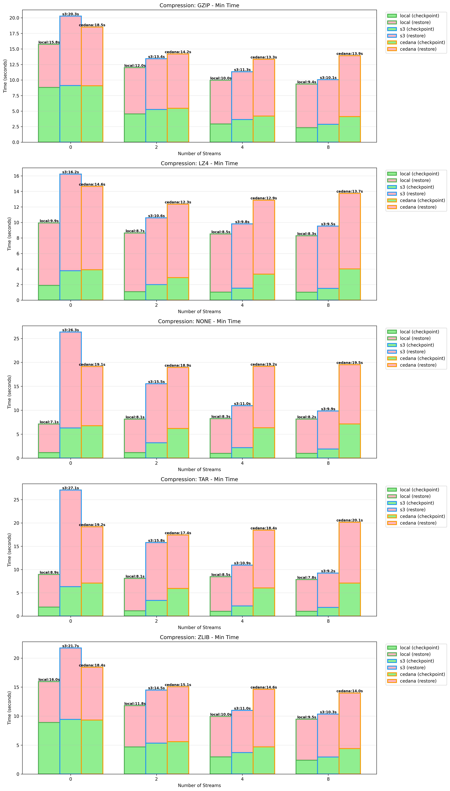
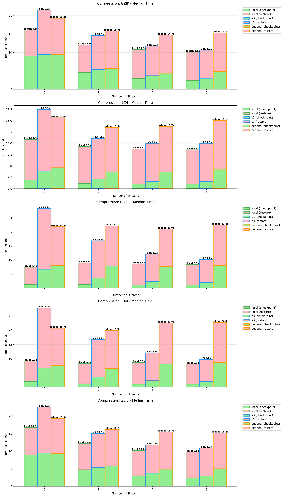
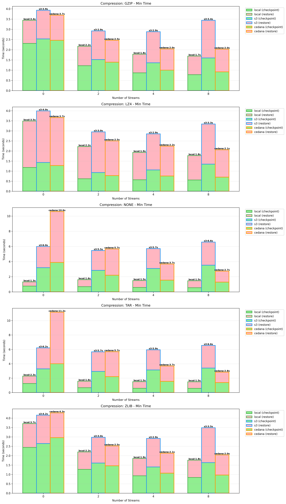
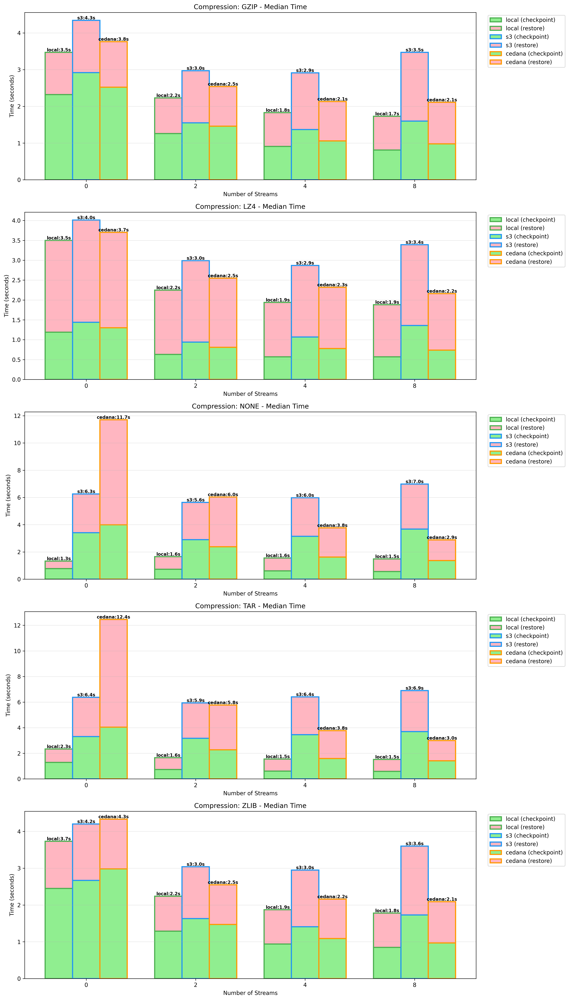
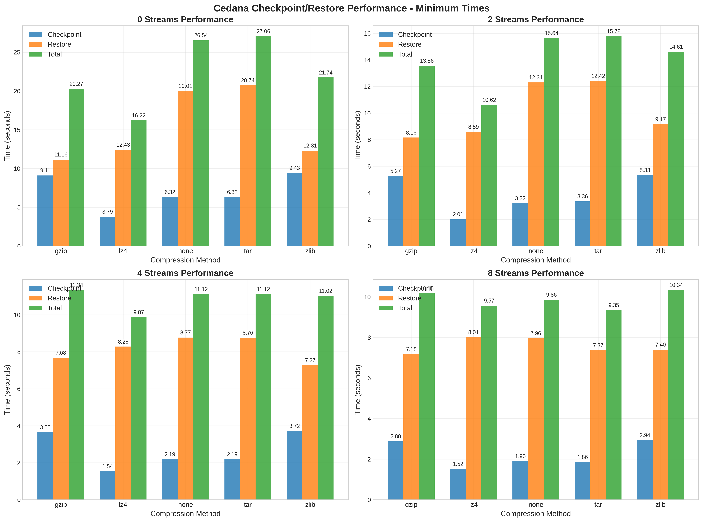
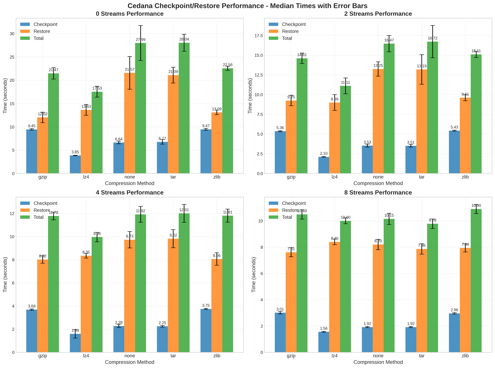
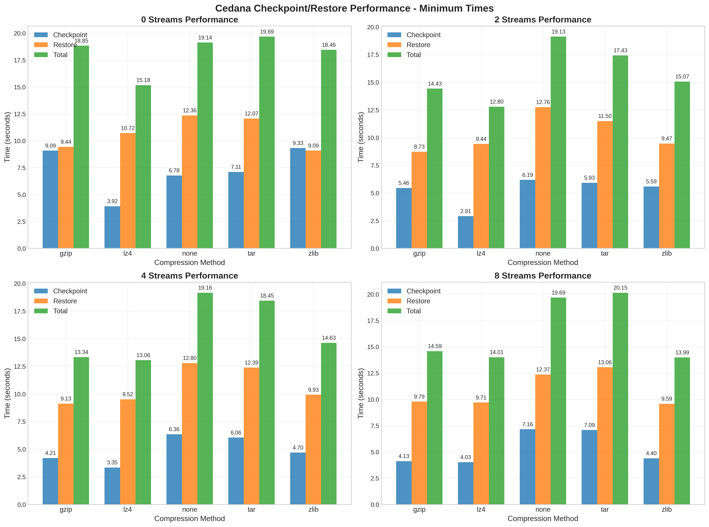
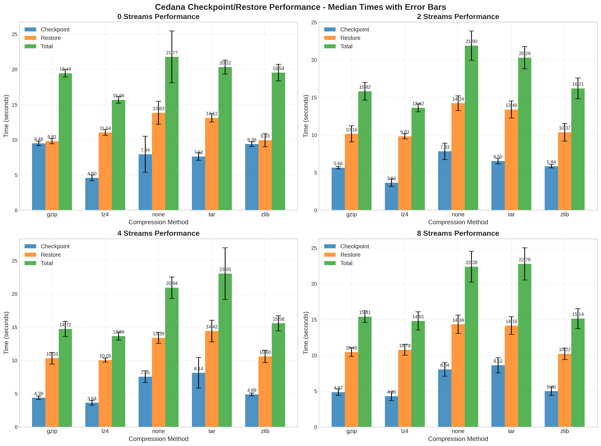
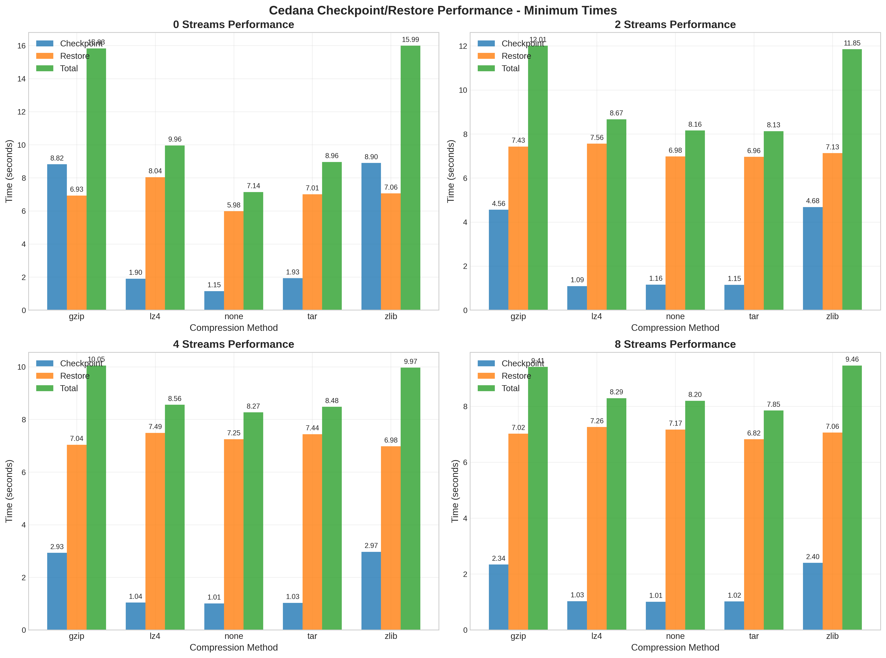
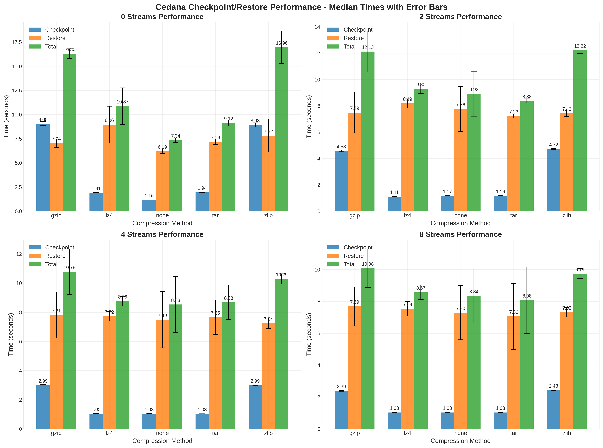

## Test Environment Info

Ran all tests on a `g6.2xlarge` ec2 instance.

```
Following Specs:
CPU:
CPU(s):                                  8
On-line CPU(s) list:                     0-7
Model name:                              AMD EPYC 7R13 Processor
BIOS Model name:                         AMD EPYC 7R13 Processor  CPU @ 2.6GHz

Memory: 30Gi

+-----------------------------------------------------------------------------------------+
| NVIDIA-SMI 570.211.01             Driver Version: 570.211.01     CUDA Version: 12.8     |
|-----------------------------------------+------------------------+----------------------+
| GPU  Name                 Persistence-M | Bus-Id          Disp.A | Volatile Uncorr. ECC |
| Fan  Temp   Perf          Pwr:Usage/Cap |           Memory-Usage | GPU-Util  Compute M. |
|                                         |                        |               MIG M. |
|=========================================+========================+======================|
|   0  NVIDIA L4                      Off |   00000000:31:00.0 Off |                    0 |
| N/A   35C    P0             29W /   72W |       0MiB /  23034MiB |      4%      Default |
|                                         |                        |                  N/A |
+-----------------------------------------+------------------------+----------------------+
```

**Network Speeds**

```
$ speedtest
Retrieving speedtest.net configuration...
Testing from Amazon.com (54.152.26.168)...
Retrieving speedtest.net server list...
Selecting best server based on ping...
Hosted by Shentel (Ashburn, VA) [0.81 km]: 1.348 ms
Testing download speed................................................................................
Download: 2155.12 Mbit/s
Testing upload speed......................................................................................................
Upload: 1809.48 Mbit/s
```

**Disk Speeds**

| Operation Type    | Sub-test      | Throughput (kB/sec) | Throughput (MB/sec) |
| :---------------- | :------------ | :------------------ | :------------------ |
| Sequential Writes | Initial Write | 629,524.62          | ~614.77 MB/s        |
| Sequential Writes | Rewrite       | 867,051.62          | ~846.73 MB/s        |
| Random Reads      | Random Read   | 642,434.19          | ~627.38 MB/s        |
| Random Writes     | Random Write  | 509,545.06          | ~497.60 MB/s        |

Based on the `iozone3` benchmark whose output can be found in `disk_speeds`.

All tests were run 5 times.

## GPU C/R Results

### Minimum Times



### Median Times


## CPU C/R Results

### Minimum Times



### Median Times


## GPU S3

```

Total tests run: 100
Configurations tested: 20

--------------------------------------------------
MINIMUM TIMES ANALYSIS (Best Case Performance)
--------------------------------------------------

Best checkpoint time: lz4 with 8 streams (1.520s)
Best restore time: gzip with 8 streams (7.180s)
Best total time: tar with 8 streams (9.350s)

--------------------------------------------------
MEDIAN TIMES ANALYSIS (Typical Performance)
--------------------------------------------------

Best checkpoint time: lz4 with 8 streams (1.560s)
Best restore time: gzip with 8 streams (7.610s)
Best total time: tar with 8 streams (9.780s)

--------------------------------------------------
STREAM PERFORMANCE COMPARISON
--------------------------------------------------
┌─────────┬────────────┬────────────┬────────────┐
│ Streams │Min Time(s) │ Median(s)  │Variance(%) │
├─────────┼────────────┼────────────┼────────────┤
│    0    │      22.366│      23.518│         5.2│
│    2    │      14.042│      14.804│         5.4│
│    4    │      10.894│      11.496│         5.5│
│    8    │       9.860│      10.264│         4.1│
└─────────┴────────────┴────────────┴────────────┘

Speedup Analysis (relative to 0 streams):
┌─────────┬───────────┬───────────┐
│ Streams │Min Speedup│Median Spd.│
├─────────┼───────────┼───────────┤
│    2    │     +37.2%│     +37.1%│
│    4    │     +51.3%│     +51.1%│
│    8    │     +55.9%│     +56.4%│
└─────────┴───────────┴───────────┘

--------------------------------------------------
COMPRESSION METHOD RANKING
--------------------------------------------------
┌─────────────┬────────────┬────────────┐
│   Method    │Min Time(s) │ Median(s)  │
├─────────────┼────────────┼────────────┤
│lz4          │      11.570│      12.150│
│gzip         │      13.838│      14.587│
│zlib         │      14.427│      15.095│
│none         │      15.790│      16.633│
│tar          │      15.827│      16.637│
└─────────────┴────────────┴────────────┘
```

### GPU S3 Minimum Times




### GPU S3 Median Times



## GPU Cedana Storage

```
Total tests run: 100
Configurations tested: 20

--------------------------------------------------
MINIMUM TIMES ANALYSIS (Best Case Performance)
--------------------------------------------------

Best checkpoint time: lz4 with 2 streams (2.910s)
Best restore time: gzip with 2 streams (8.730s)
Best total time: lz4 with 2 streams (12.800s)

--------------------------------------------------
MEDIAN TIMES ANALYSIS (Typical Performance)
--------------------------------------------------

Best checkpoint time: lz4 with 4 streams (3.640s)
Best restore time: gzip with 0 streams (9.810s)
Best total time: lz4 with 2 streams (13.620s)

--------------------------------------------------
STREAM PERFORMANCE COMPARISON
--------------------------------------------------
┌─────────┬────────────┬────────────┬────────────┐
│ Streams │Min Time(s) │ Median(s)  │Variance(%) │
├─────────┼────────────┼────────────┼────────────┤
│    0    │      18.264│      19.346│         5.9│
│    2    │      15.772│      17.568│        11.4│
│    4    │      15.728│      17.590│        11.8│
│    8    │      16.486│      18.104│         9.8│
└─────────┴────────────┴────────────┴────────────┘

Speedup Analysis (relative to 0 streams):
┌─────────┬───────────┬───────────┐
│ Streams │Min Speedup│Median Spd.│
├─────────┼───────────┼───────────┤
│    2    │     +13.6%│      +9.2%│
│    4    │     +13.9%│      +9.1%│
│    8    │      +9.7%│      +6.4%│
└─────────┴───────────┴───────────┘

--------------------------------------------------
COMPRESSION METHOD RANKING
--------------------------------------------------
┌─────────────┬────────────┬────────────┐
│   Method    │Min Time(s) │ Median(s)  │
├─────────────┼────────────┼────────────┤
│lz4          │      13.762│      14.438│
│gzip         │      15.303│      16.348│
│zlib         │      15.538│      16.617│
│tar          │      18.930│      21.610│
│none         │      19.280│      21.747│
└─────────────┴────────────┴────────────┘
```


### GPU Cedana Storage Minimum Times




### GPU Cedana Storage Median Times



## GPU Local Storage

```
Total tests run: 100
Configurations tested: 20

--------------------------------------------------
MINIMUM TIMES ANALYSIS (Best Case Performance)
--------------------------------------------------

Best checkpoint time: none with 4 streams (1.010s)
Best restore time: none with 0 streams (5.980s)
Best total time: none with 0 streams (7.140s)

--------------------------------------------------
MEDIAN TIMES ANALYSIS (Typical Performance)
--------------------------------------------------

Best checkpoint time: lz4 with 8 streams (1.030s)
Best restore time: none with 0 streams (6.190s)
Best total time: none with 0 streams (7.340s)

--------------------------------------------------
STREAM PERFORMANCE COMPARISON
--------------------------------------------------
┌─────────┬────────────┬────────────┬────────────┐
│ Streams │Min Time(s) │ Median(s)  │Variance(%) │
├─────────┼────────────┼────────────┼────────────┤
│    0    │      11.576│      12.118│         4.7│
│    2    │       9.764│      10.190│         4.4│
│    4    │       9.066│       9.408│         3.8│
│    8    │       8.642│       8.962│         3.7│
└─────────┴────────────┴────────────┴────────────┘

Speedup Analysis (relative to 0 streams):
┌─────────┬───────────┬───────────┐
│ Streams │Min Speedup│Median Spd.│
├─────────┼───────────┼───────────┤
│    2    │     +15.7%│     +15.9%│
│    4    │     +21.7%│     +22.4%│
│    8    │     +25.3%│     +26.0%│
└─────────┴───────────┴───────────┘

--------------------------------------------------
COMPRESSION METHOD RANKING
--------------------------------------------------
┌─────────────┬────────────┬────────────┐
│   Method    │Min Time(s) │ Median(s)  │
├─────────────┼────────────┼────────────┤
│none         │       7.942│       8.282│
│tar          │       8.355│       8.565│
│lz4          │       8.870│       9.375│
│zlib         │      11.818│      12.303│
│gzip         │      11.825│      12.322│
└─────────────┴────────────┴────────────┘
```

### GPU Local Storage Minimum Times




### GPU Local Storage Median Times


