# Old vs New Graphs

- `cuda_stress` has an approximate checkpoint size of `~700MB`; `stress_py` has an approximate checkpoint size of `~500MB`.
- "Without memory limit" refers to Streamer behavior before the memory-limit change (pre-change baseline).

- `GPU == cuda_stress`
- `CPU == stress_py`

## GPU CEDANA STORAGE STREAMS = 2

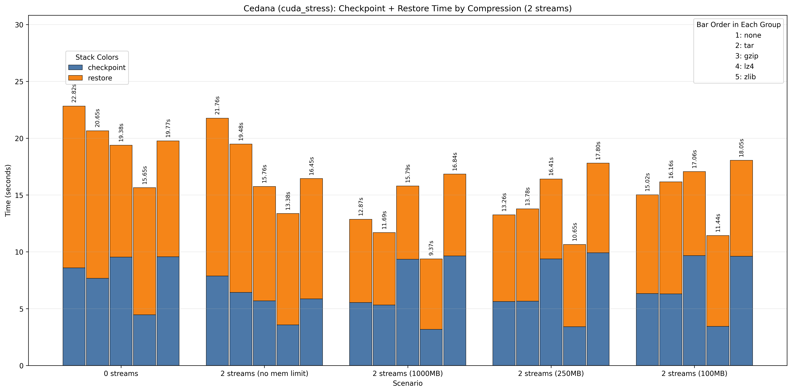

## GPU CEDANA STORAGE STREAMS = 4

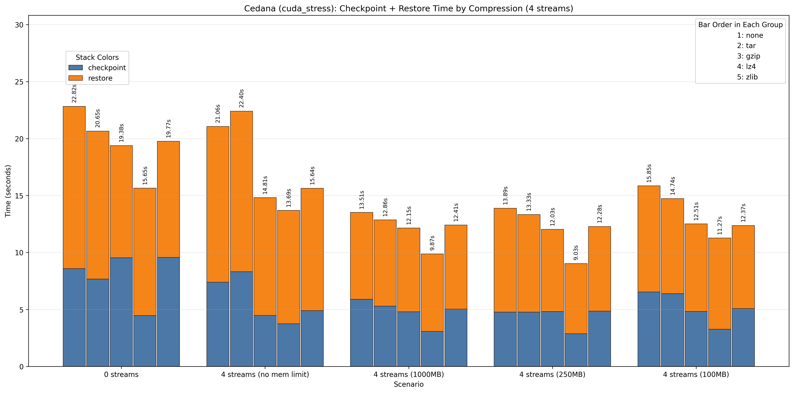

## GPU CEDANA STORAGE STREAMS = 8

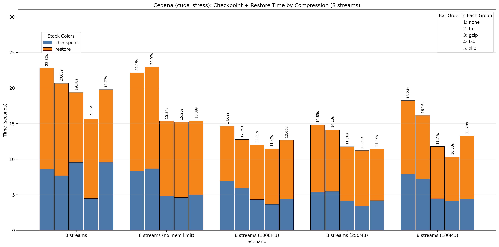

## CPU CEDANA STORAGE STREAMS = 2

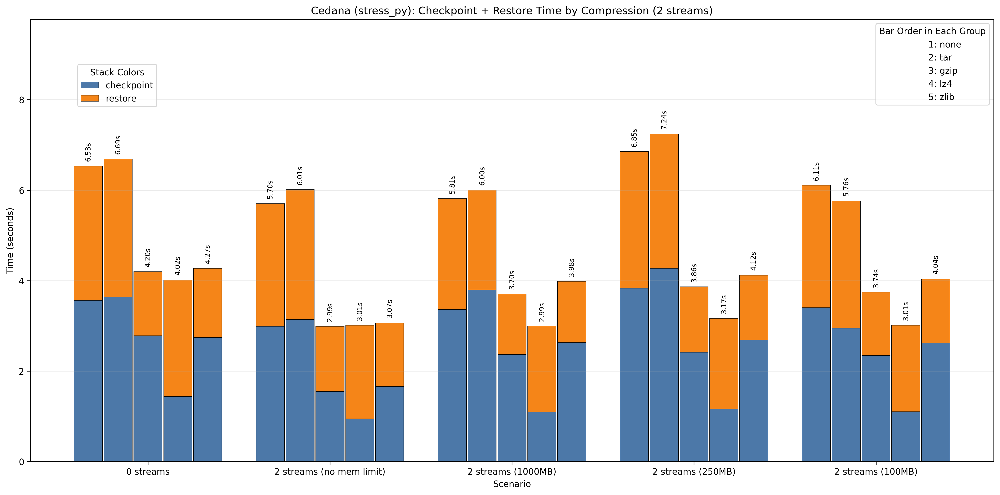

## CPU CEDANA STORAGE STREAMS = 4

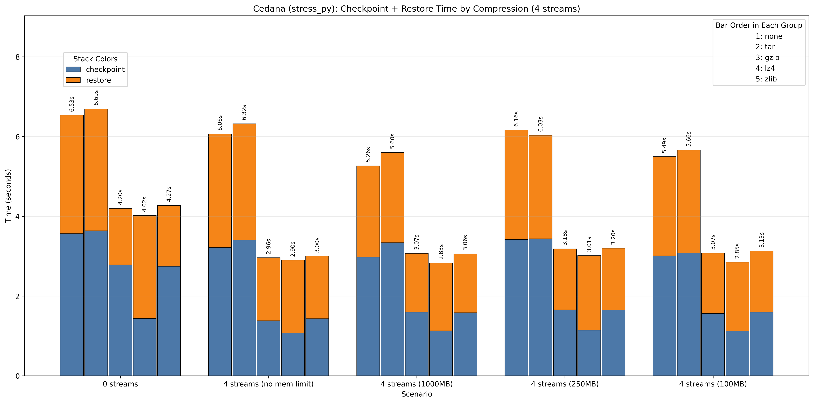

## CPU CEDANA STORAGE STREAMS = 8

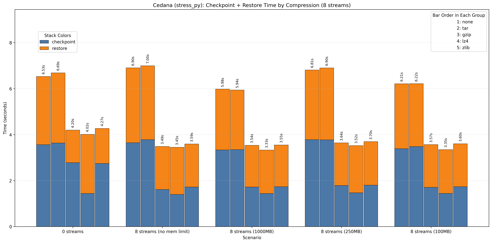

## GPU LOCAL STREAMS = 2

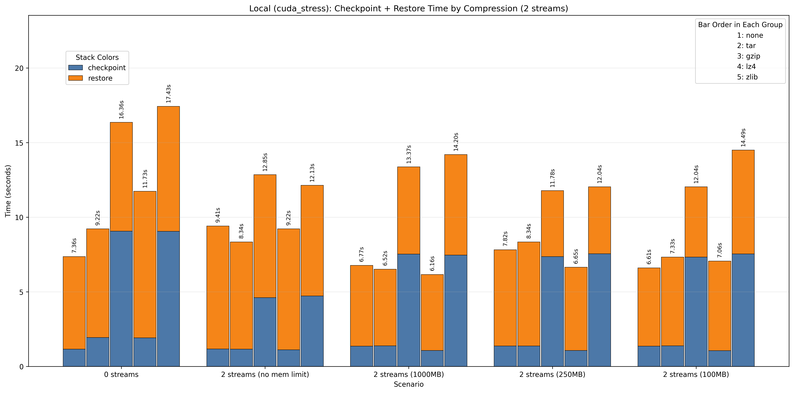

## GPU LOCAL STREAMS = 4

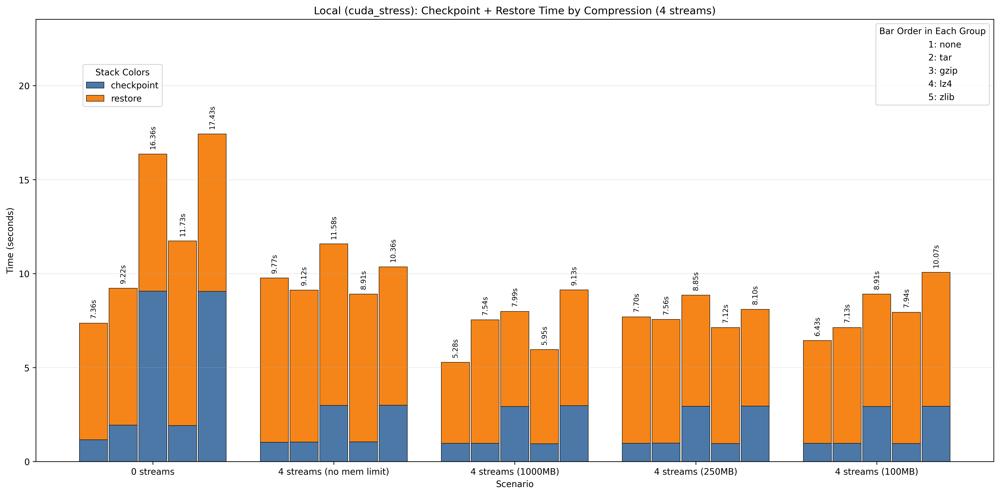

## GPU LOCAL STREAMS = 8

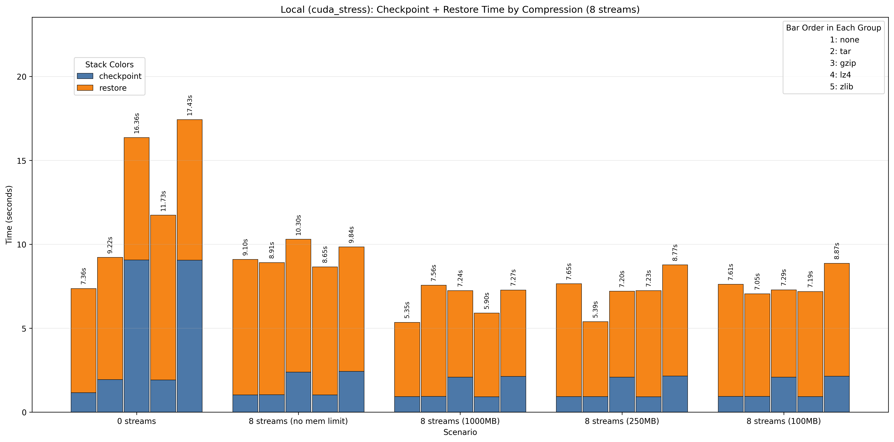

## CPU LOCAL STREAMS = 2

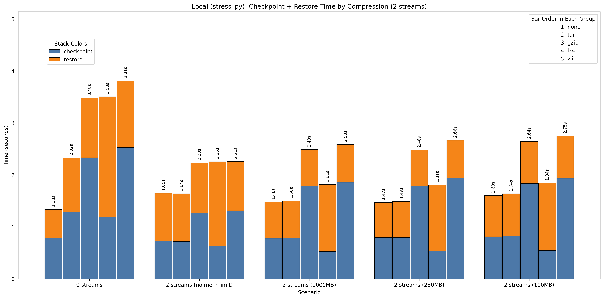

## CPU LOCAL STREAMS = 4

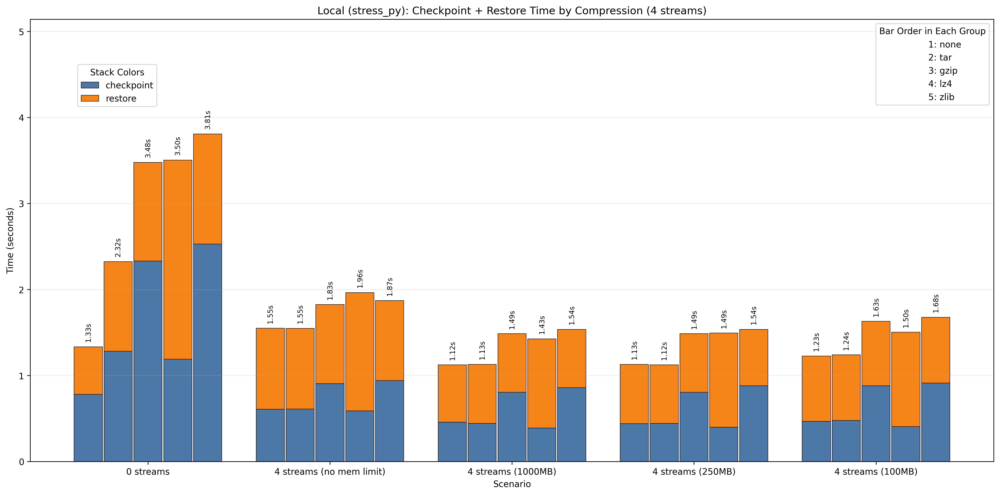

## CPU LOCAL STREAMS = 8

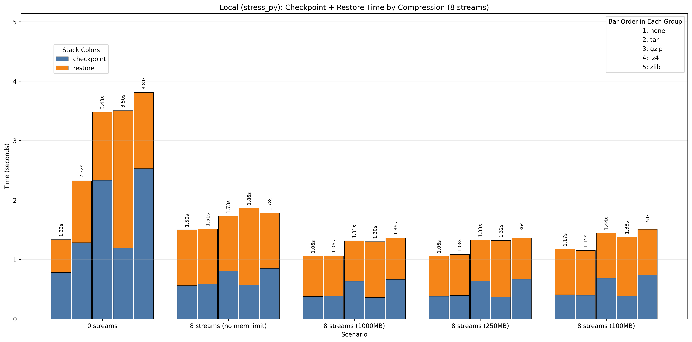
